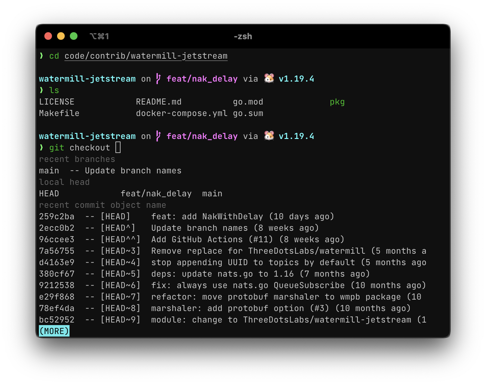

# Configs

### zsh

#### Install

1. Clone this repo. [zsh](zsh) folder must be inside `~/.config`

```bash
git clone git@github.com:qulaz/configs.git
git submodule init && git submodule update
mkdir -p ~/.config && mv configs/* ~/.config
```

2. Set `ZDOTDIR` variable in `~/.zshenv`

```bash
echo "export ZDOTDIR=$HOME/.config/zsh" > ~/.zshenv
```

3. Create cache dir for zsh history

```bash
mkdir -p $HOME/.cache/zsh/
```

4. Install any [Nerd Font](https://www.nerdfonts.com/font-downloads) and set it as default font
   in your terminal emulator. I usually use JetBrains Mono
5. Install [Starship shell theme](https://starship.rs/guide/#%F0%9F%9A%80-installation)

#### Requirements

Without this tools config wont work properly

1. [brew](https://brew.sh/)
2. [Starship shell theme](https://starship.rs/guide/#%F0%9F%9A%80-installation)
3. [pyenv](https://github.com/pyenv/pyenv) - https://matt.sh/unify-python
4. [gvm](https://github.com/moovweb/gvm)

Note for ARM macs. There is how install go 1.5+ with gvm. [cc](https://github.com/moovweb/gvm/issues/360#issuecomment-797895876)

```bash
curl -sSL https://go.dev/dl/go1.16.darwin-arm64.tar.gz | tar zxv
export GOROOT_BOOTSTRAP="$(pwd)/go"
gvm install go1.19.4
Downloading Go source...
Installing go1.19.4...
 * Compiling...
go1.19.4 successfully installed!
rm -rf go
```

#### Preview


